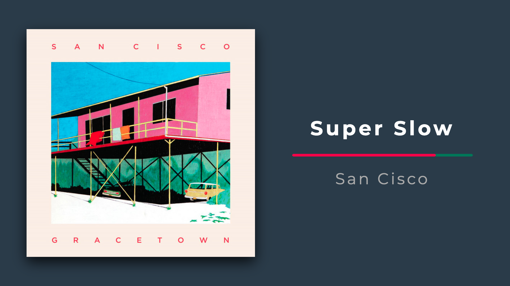
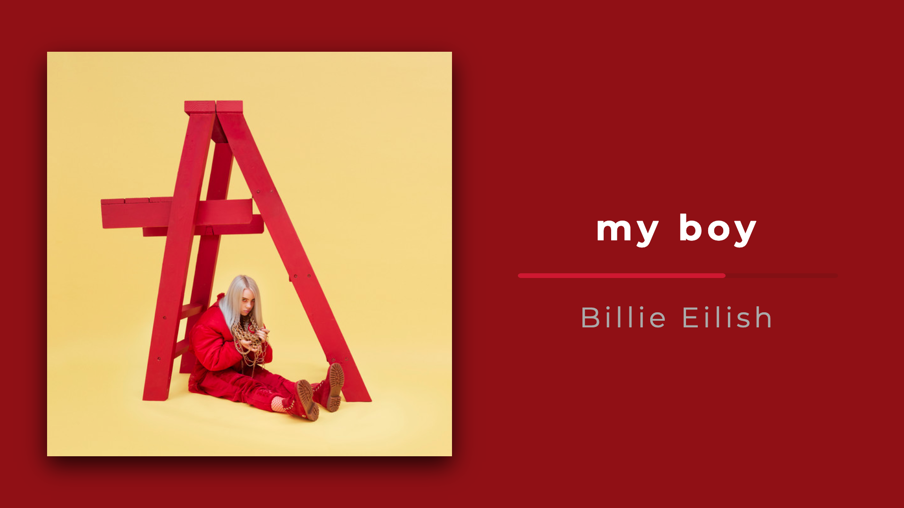
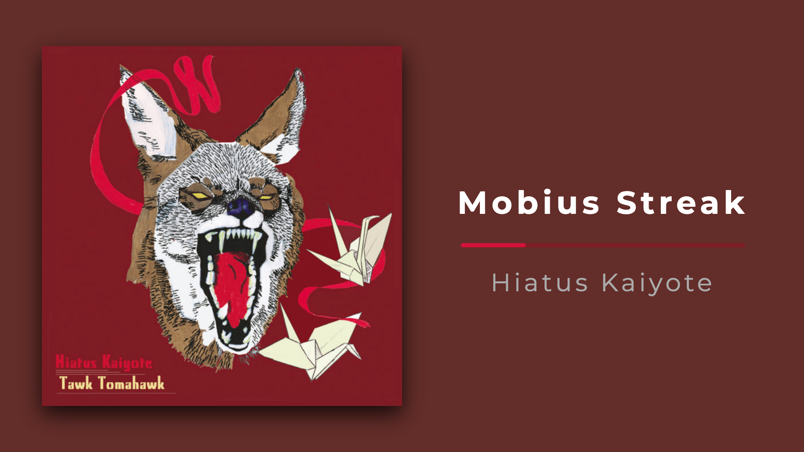

# clean spotify player

A simple app that displays basic info about your currently playing music on Spotify.
You can use it by simply visiting this page:
<https://clean-spotify-player.hostman.site>

### features
- fullscreen mode
- works 24/7, it auto-refreshes Spotify's token
- responsive
- prevents screen from 'sleeping' when in fullscreen mode

### roadmap (PRs are welcomed!)
- podcasts support
- choose whether playlist images should be displayed when available
- SPICY COLORS MODE 🔥
### how to run in developement mode
1. Go to [Spotify's developer website](https://developer.spotify.com/dashboard/login) and create a new app and write down your CLIENT_ID and SECRET_ID (takes 1 minute).
2. In your Spotify project dashboard click 'edit settings' and add 'http://localhost:4000/callback' to your Redirect URIs. Then click 'save'.
3. Clone/fork this repo.
4. And clone/fork [this repo as well](https://github.com/mieszkosabo/clean-spotify-backend).
5. Run React app (this repo) with ```npm install && npm start```.
6. create '.env' file in server's (clean-spotify-backend repo ) top directory and put your Spotify's IDs like this:
...```CLIENT_ID=blablablab24124example```
7. Run server  with ```node app.js```.

### screenshots




